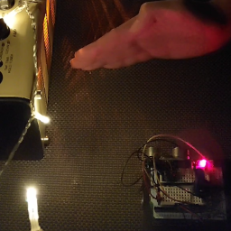

# Frequency modulated Christmas

This is an Arduino musical toy using the Mozzi library.

Here's a short demo:

Hardware is Arduino Uno, ultrasonic sensor, potentiometer, and an amp.

Mozzi lib is doing all the hard work, with some of my code to play a song, and control frequency modulation.

Mozzi triangle oscillator is used for the carrier, and sine is used for modulation.

The ultrasonic sensor is controlling both modulation amplitude and carrier vs mod frequency ratio.

Pot is controlling length of the notes (something like staccato), but it's not that noticeable in the demo.

The amp is adding some chorus and delay.

### Credits
The song score kindly provided by https://github.com/robsoncouto/arduino-songs